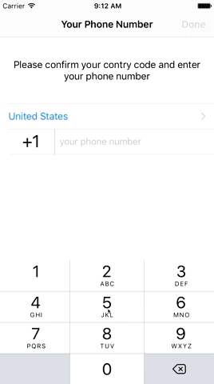

# UXPhoneNumberInput

[](https://travis-ci.org/Eddie Lau/UXPhoneNumberInput)
[](http://cocoapods.org/pods/UXPhoneNumberInput)
[](http://cocoapods.org/pods/UXPhoneNumberInput)
[](http://cocoapods.org/pods/UXPhoneNumberInput)

## Example

To run the example project, clone the repo, and run `pod install` from the Example directory first.

## Demo

[

## Usage

```swift
  let phoneInputVC = UXPhoneNumberInputViewController.instantiate()

  phoneInputVC.done { phoneNumber in

      print(phoneNumber)

  }
```

## Requirements

Xcode 8, Swift 3, iOS 8

## Installation

UXPhoneNumberInput is available through [CocoaPods](http://cocoapods.org). To install
it, simply add the following line to your Podfile:

```ruby
pod "UXPhoneNumberInput"
```

## Author

Eddie Lau, eddie@touchutility.com

## License

UXPhoneNumberInput is available under the MIT license. See the LICENSE file for more info.
